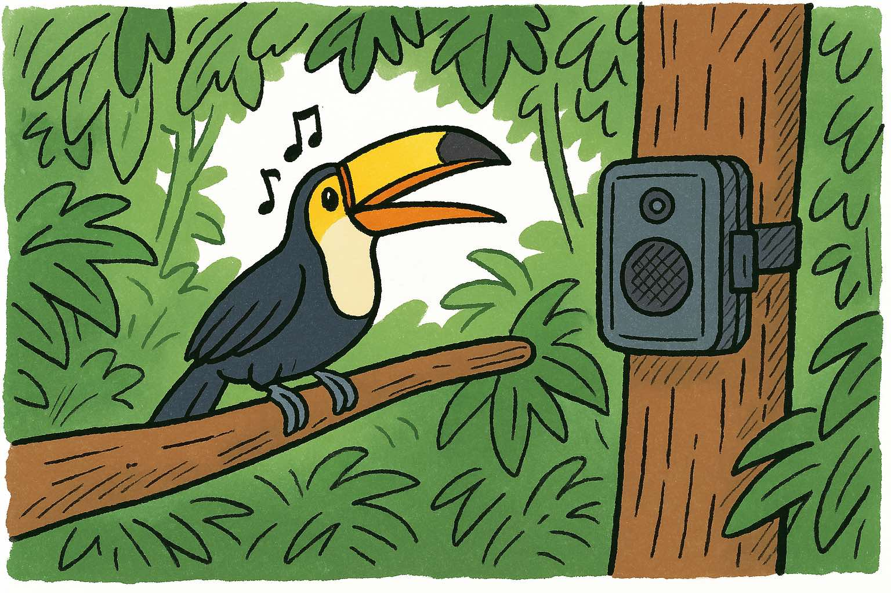

# Beginner's guide

This guide will walk you through the steps for running **pamflow** and understanding its outputs. For this, we will use an immersive example with real acoustic data. Once you are familiar with this example, you will be able to run **pamflow** with your own data. The tutorial takes approximately 30 minutes to complete.

***Context: The Guaviare Project***
*The XXXX Institute in Colombia collaborated with communities in Guaviare, Colombia to conduct a community monitoring project on local bird fauna using passive acoustic monitoring (PAM). You are part of the project and your task is to process the audio recordings, extract insights, and produce relevant metrics and visualizations for a project report.*

***Your tasks***:
1. Get familiar with the collected data.
2. Organize the data following the required format.
3. Verify that all recorders performed as expected.
4. Report the presence of target species in the recordings.
5. Extract audio segments containing target species vocalizations for validation.

Make sure **pamflow** and its tools are installed before you start ([instructions here](setup.md)). If you are an experienced python user and want a faster, less detailed set-up you can find it [here](../documentation/index.md).




```{toctree}
:maxdepth: 1
:caption: Tutorial
input_data.md
data_preparation.md
quality_control.md
species_detection.md


