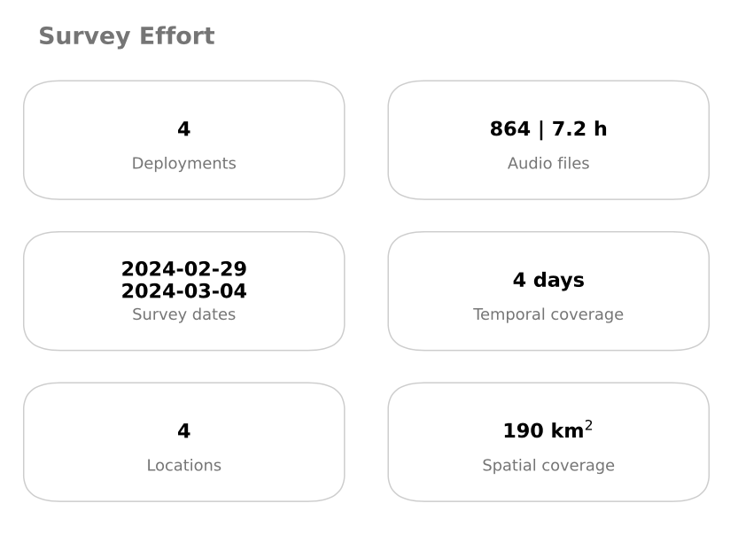
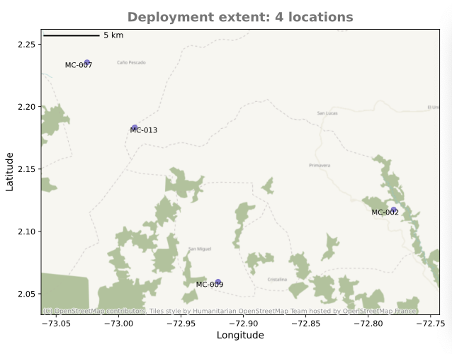
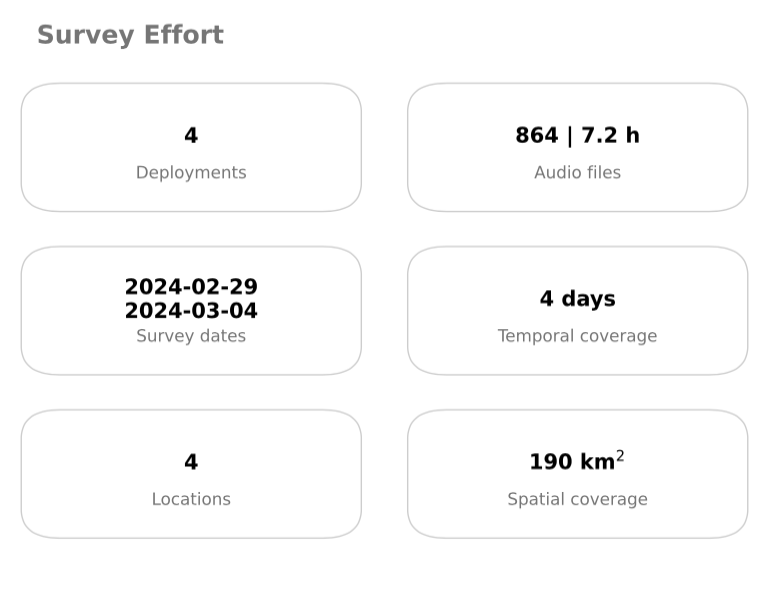
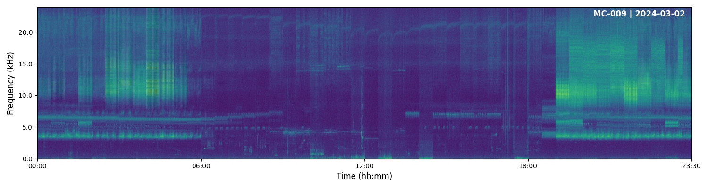
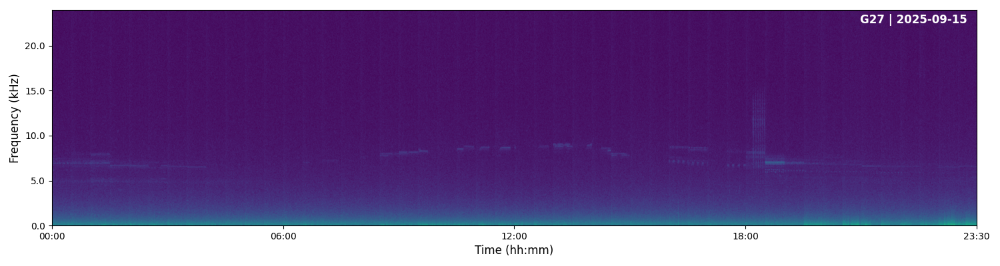

## Quality control

Now that you have extracted metadata from the recordings, you are ready to assess their quality. Many things can go wrong during a PAM project: a deployment can run out of battery, be damaged after installation, or not be set up correctly, among other issues. In this section you will learn how to verify that all deployments behaved as expected.

### Run the quality control pipeline

This pipeline generates a set of visual outputs to help you explore the data and identify any deployments that may have not performed as expected. To run it:

```bash
kedro run --pipeline quality_control
```

### Check deployment timeline

Recall that the {{number_of_sensors}} recorders were programmed to record one minute every 30 minutes for {{number_of_days}} days, so each recorder was expected to collect 48 files per day. You can visually check this in `data/output/quality_control/deployment_timeline.pdf`:



Each dot shows the total minutes recorded by one recorder on one day. Ideally, all dots should be the same size, representing 48 minutes. Larger values may indicate accidental activation before installation or incorrect programming; smaller values may indicate battery failure or malfunction. Unusual values require further examination.

In this figure, we can identify that deployment {{broken_sensor_1}} shows inconsistencies. In further steps you may want to discard its recordings to ensure consistency across recorders.

### Check deployment locations

A map of all deployment locations is generated to help verify that coordinates are correct. Check the output at `data/output/quality_control/deployment_location.png`:




### Check survey effort

A summary card with the key details of the deployment is also generated:




### Timelapses

Even if all recorders collected the expected number of files, recording quality may still be compromised — for example, if the microphone is blocked or damaged. To check this without listening to every file, **pamflow** can generate a timelapse: a one-day audio summary built by concatenating 5 seconds from each recording for a particular day, along with the corresponding spectrogram. Results are saved in `data/output/quality_control/timelapse/`.

Below are two example timelapse spectrogram outputs:




The first spectrogram shows acoustic activity across different frequencies and times, as expected, with wind affecting lower frequency bands during the day. The second shows no activity, indicating that recorder was not functioning correctly. You may want to discard these recordings in further steps to save computational resources and maintain data quality.

In the [next](./species_detection.md) section you will learn how to detect target species in your recordings.