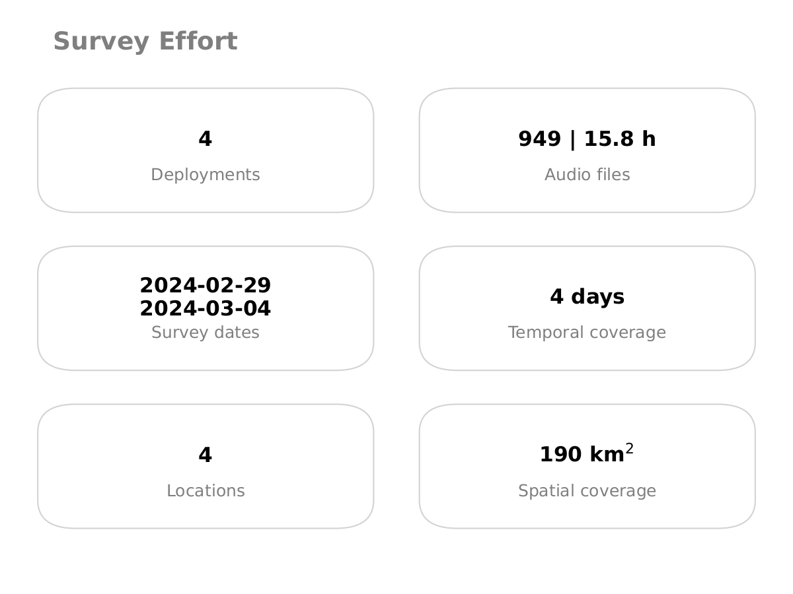

## Quality control

Now that you have extracted metadata from the recordings, you are ready to assess their quality. Many things can go wrong during a PAM project: a recorder can run out of battery, be damaged after installation, or not be set up correctly, among other issues. In this section you will learn how to use **pamflow** to verify that all recorders behaved as expected.

### Run quality control pipeline

This pipeline facilitates an initial data exploration and spot faulty sensors. 
To run this pipeline, just type into your terminal:

```bash
kedro run --pipeline quality_control
```

### Check recorder performance

Recall that the {{number_of_sensors}} recorders were programmed to record one minute every 30 minutes for {{number_of_days}} days, so each recorder was expected to collect 48 files per day. You can visually check this in `data/output/quality_control/sensor_performance.png`:


Each dot shows the total minutes recorded by one recorder on one day. Ideally, all dots should be the same size, representing 48 minutes. Larger values may indicate accidental activation before installation or incorrect programming; smaller values may indicate battery failure or malfunction. Unusual values require further examination.

In this case, **pamflow** identified that recorder {{broken_sensor_1}} failed on one day. In further steps you may want to discard its recordings for that day — or entirely — to ensure consistency across recorders.

### Check recorder locations

**pamflow** generates a map of all deployment locations to help verify that coordinates are correct. Check the output at `data/output/quality_control/sensor_location.png`:


### Check survey effort

**pamflow** also generates a summary card with the key details of the deployment:



### Timelapses

Even if all recorders collected the expected number of files, recording quality may still be compromised — for example, if the microphone is blocked or damaged. To check this without listening to every file, **pamflow** can generate a timelapse: a one-day audio summary built by concatenating 5 seconds from each recording, along with the corresponding spectrogram. Results are saved in `data/output/quality_control/timelapse/`.

Below are two example spectrogram outputs:

Spectrogram for recorder MC-002               |
:-------------------------------------------: |
  |
:-------------------------:                   |
 Spectrogram for recorder {{broken_sensor_2}} |
   |

The first spectrogram shows acoustic activity across different frequencies and times, as expected. The second shows no activity, indicating that recorder {{broken_sensor_2}} was not functioning correctly. You may want to discard these recordings in further steps to save computational resources and maintain data quality.

In the [next](./species_detection.md) section you will learn how to detect target species in your recordings.