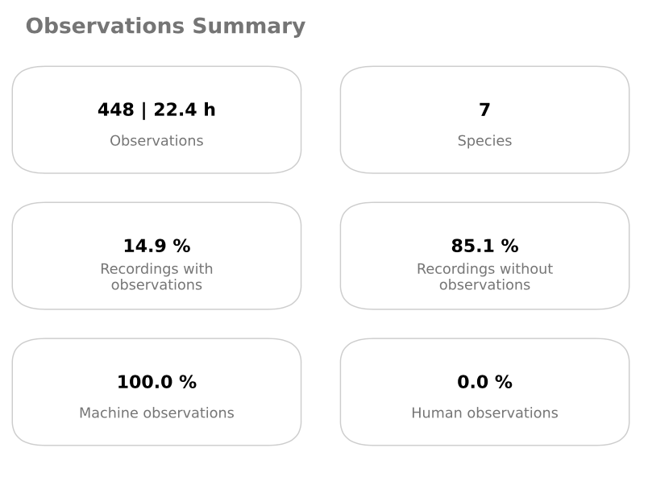
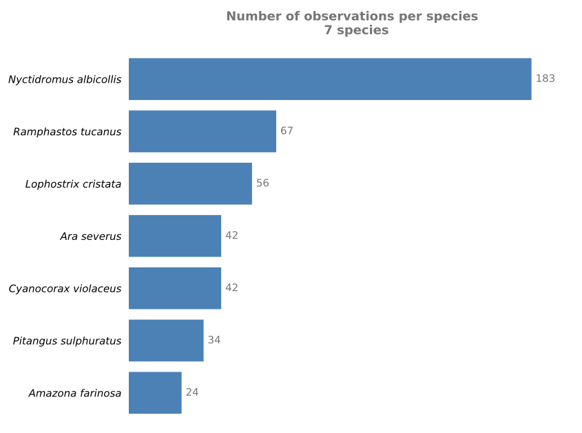
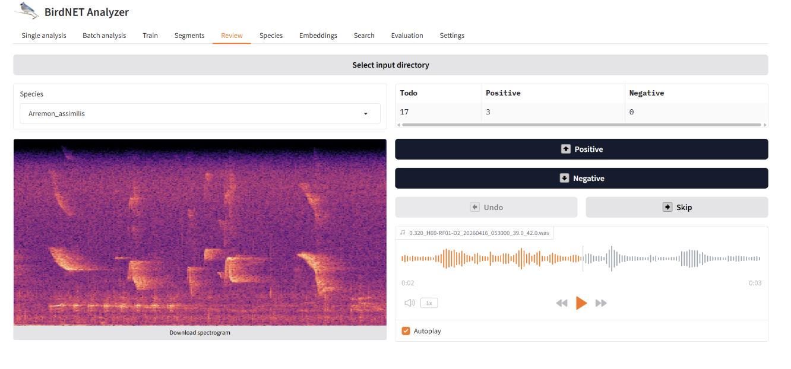

## Species detection

In this section you will run the `species_detection` pipeline, which automatically detects and identifies species in the recordings using the [BirdNET](https://github.com/kahst/BirdNET-Analyzer) model, filters results for your target species list, and extracts audio segments containing relevant vocalizations. Additional models will be integrated in future versions of **pamflow**.

To run the pipeline:

```bash
pamflow run --pipeline species_detection
```

### Detection outputs

The pipeline produces two summary figures and two output files.

The figures are stored in `data/output/species_detection/`:

- `observations_summary.pdf` — a high-level summary showing total observations, number of species detected, and the proportion of recordings with detections
- `observations_per_species.pdf` — a bar chart showing the number of detections per species

 

The output files are also stored in `data/output/species_detection/`:


- `unfiltered_observations.csv` — all detections regardless of species
- `observations.csv` — detections filtered to your `target_species` list only (see [Input data](./input_data.md#target-species))

Each row represents one detection, with the audio file name, timestamp, species scientific name, and the model's confidence score. You can learn more about the file format in the [Data Exchange Formats](../data_standardization/data_exchange_format.md#Observations) section.

| observationID | deploymentID | mediaID                        | scientificName       | eventStart | eventEnd | classifiedBy  | classificationProbability | ... |
|---------------|--------------|--------------------------------|----------------------|------------|----------|---------------|---------------------------|-----|
| 0             | MC-002       | MC-002_20240229_003000.WAV     | Lophostrix cristata  | 12.0       | 15.0     | Birdnet 2.4   | 0.191                     | ... |
| 1             | MC-002       | MC-002_20240229_003000.WAV     | Lophostrix cristata  | 42.0       | 45.0     | Birdnet 2.4   | 0.112                     | ... |
| 2             | MC-002       | MC-002_20240229_003000.WAV     | Lophostrix cristata  | 51.0       | 54.0     | Birdnet 2.4   | 0.118                     | ... |
| 3             | MC-002       | MC-002_20240229_033000.WAV     | Ciccaba virgata      | 21.0       | 24.0     | Birdnet 2.4   | 0.144                     | ... |
| 4             | MC-002       | MC-002_20240229_033000.WAV     | Ciccaba virgata      | 30.0       | 33.0     | Birdnet 2.4   | 0.103                     | ... |
| ...           | ...          | ...                            | ...                  | ...        | ...      | ...           | ...                       | ... |

```{note}
Detection confidence scores are low by default — **pamflow** reports all detections above 0.1, so results should always be reviewed carefully. For example, *Lophostrix cristata* detections in this dataset are suspicious given that the deployment site is a pasture, where this forest owl would be unexpected. The audio segments and annotation files in the following steps are designed precisely to help with this review. For further guidance on interpreting model outputs, see [Wood and Kahl (2024)](https://link.springer.com/article/10.1007/s10336-024-02144-5).
```

### Audio segments

To validate the detections, audio segments for each target species are saved in `data/output/species_detection/segments/`, with one subfolder per species. These clips can be shared with bird experts for manual review and confirmation. The number of segments selected per species can be configured in `conf/local/parameters.yml`.

Each clip is named following this structure:

`<classificationProbability>_<originalFileName>_<startTime>_<endTime>.WAV`

This makes it easy to identify the source recording, the time of the vocalization, and the model's confidence in its identification.

### Data annotation

To make expert review straightforward, one Excel file per target species is generated in `data/output/species_detection/manual_annotations/`. Each file lists the selected audio segments for that species. Once the audio clips have been reviewed, the expert only needs to fill in two columns:

- `positive` — type `true` if the detection is correct, `false` if not
- `detectedSpecies` — if the detection is incorrect, type the actual species name (if known)

The completed annotation files feed back into **pamflow** in subsequent steps to refine and validate the final results.

For example, the annotation file for *Amazona farinosa* looks like this:

| segmentsFilePath                                      | filePath                                    | classificationProbability | eventStart | eventEnd | scientificName     | positive | detectedSpecies |
|-------------------------------------------------------|---------------------------------------------|---------------------------|------------|----------|-------------------|----------|----------------|
| 0.841_MC-009_20240301_073000_36.0_39.0.WAV            | .../MC-009/MC-009_20240301_073000.WAV       | 0.841                     | 36         | 39       | Amazona farinosa  |          |                |
| 0.684_MC-009_20240301_073000_0.0_3.0.WAV              | .../MC-009/MC-009_20240301_073000.WAV       | 0.684                     | 0          | 3        | Amazona farinosa  |          |                |
| 0.659_MC-009_20240301_073000_33.0_36.0.WAV            | .../MC-009/MC-009_20240301_073000.WAV       | 0.659                     | 33         | 36       | Amazona farinosa  |          |                |
| 0.653_MC-009_20240301_073000_30.0_33.0.WAV            | .../MC-009/MC-009_20240301_073000.WAV       | 0.653                     | 30         | 33       | Amazona farinosa  |          |                |

Now that the annotation files are ready, let's move on to the [next step](./detection_validation.md) to validate the detections and get a recommended threshold per species.

### Optional: Reviewing detections with the BirdNET GUI

#### Reviewing Detected Segments with the BirdNET GUI

The audio segments produced by `pamflow` can be reviewed directly using the BirdNET Analyzer GUI. This provides a convenient way to manually inspect detected segments, listen to the corresponding audio, and validate detections using BirdNET's review interface. 

#### Before You Start


```{note}
Before opening the segments in BirdNET, ensure that the audio files use the lowercase `.wav` extension. Depending on the operating system and workflow, `pamflow` may generate files with an uppercase `.WAV` extension, while the BirdNET GUI expects `.wav` files during review. Only the filename extension needs to be changed; no audio conversion is required. 
```

For example:

```text
segment_001.WAV
```

should be renamed to:

```text
segment_001.wav
```

#### Opening Segments in BirdNET

Once the file extension has been changed, the directory containing the segments can be opened directly from the BirdNET GUI review interface. 

1. Open the **BirdNET GUI**.
2. Navigate to the **Review** section.
3. Select the option to open or load audio files for review.
4. Navigate to the directory containing the segments generated by **pamflow**.
5. Select the `.wav` segments and load them into the interface. 

#### Validating Detections

After loading the segments, BirdNET allows users to review detections individually. Users can:

- Listen to the detected audio segments.
- Review the corresponding BirdNET detections.
- Manually validate or reject detections. 

This workflow provides an efficient mechanism for expert validation while leveraging the detection and export capabilities of **pamflow**.

