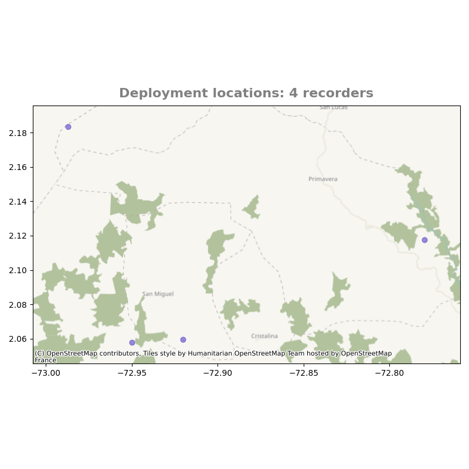

## Quality control

 Many things can go wrong during a PAM  project: a recorder can run out off battery,  break after the installation for external factors, not be installed in the right way and many more. In this section you will learn how to use **pamflow**  to check  all deployed  sensors behaved as expected.

***Table of Contents***: 
1. [Sensor performance](#sensor-performance)
2. [Sensor location](#sensor-location)
3. [Timelapses](#timelapses)

### Sensor performance
Recall that the {{number_of_sensors}} installed sensors where  programmed for recording one minute each 30 minutes for {{number_of_days}} days. We would expect then that every sensor recorded 48 one-minute files. You can easilly and visually check if this behaviour was met using **pamflow** by typing 

```bash
kedro run --nodes plot_sensor_performance
```

in the command line. 

As soon as the process is over we can check for the result in the path `data\output\quality_control\sensor_performance.png`

 

 Each dot in this plot represents the total recorded  minutes for one sensor in one day out of the {{number_of_days}} days the sensors were recording. The size of the dot is proportional to this quantity. In a perfect scenario every point should be the same size and all representing 48 minutes. More than 48 minutes in one sensor might be due to involuntary activation previous to the installation or due to wrong programmation. Less than 48 minutes might mean the sensor ran out of battery or broke during deployment. In any of these cases, further examination is required. 

 In this case, **pamflow** helped us identify that sensor {{number_of_sensors}} failed on one day. In further steps we might want to discard the information of this sensor on this day (or even all the recordings by this sensor) to guarentee unifromity among the compared sensors. 
### Sensor location

In order to check the coordinates for each sensor  **pamflow** creates a map of the installed sensors. This map also depicts the number of total recordings. To obtain the map run 
```bash
kedro run --nodes plot_sensor_location
```
and check for the output in `data\output\quality_control\sensor_location.png`

 
### Timelapses

Even if the number of recordings were right for all sensors, the quality of the recordings might still be under a desiered standard. A physical object might be blocking the sounds or the microphone might be somehow broken. To check this without listening to  each of the recordings yourself you can generate a timelapse using **pamflow**. A timelapse summarizes the acoustic activity on one day. Using a date of good enough overall acoustic activity among the sensors, **pamflow** generates an audio file for each sensor consisting of 5 seconds out of each recorded audio by that sensor at that day. Along with the audio, **pamflow** generates the corresponding spectrograms. To obtain the timelapses for each sensor run 

```bash
kedro run --nodes get_timelapse_node
```

Both the resulting audio and spectrograms can be found  in `data\output\quality_control\timelapse`

``` 
data/
├── input/                        
└── output/                          
    ├── quality_control/          
    │   ├── timelapse/            # Timelapse outputs for quality control
    │       ├── MC-002_timelapse_2024-03-02.png  # Spectrogram for sensor MC-002
    │       ├── MC-002_timelapse_2024-03-02.WAV  # Timelapse audio for sensor MC-002
    │       ├── MC-003_timelapse_2024-03-02.png  # Spectrogram for sensor MC-003
    │       ├── MC-003_timelapse_2024-03-02.WAV  # Timelapse audio for sensor MC-003
    │       ├── MC-009_timelapse_2024-03-02.png  # Spectrogram for sensor MC-009
    │       ├── MC-009_timelapse_2024-03-02.WAV  # Timelapse audio for sensor MC-009
    │       ├── MC-013_timelapse_2024-03-02.png  # Spectrogram for sensor MC-013
    │       └── MC-013_timelapse_2024-03-02.WAV  # Timelapse audio for sensor MC-013
    └──               
```

Bellow, you will find two  examples for the resulting timelapse spectrograms
Spectrogram for sensor MC-002                |  Spectrogram for sensor MC-003
:-------------------------------------------:|:-------------------------:
 |  

In the first different signals are present in different frequencies and times. Meanwhile, the second one is not showing acoustic activity. This means that the recording quality of sensor MC-003 is not as expected. You might want to discard these recordings in further steps for saving computational resources and keep the high quality of your data.

In the [next](./species_detection.md) section you will learn how to use **pamflow** for detecting target species in your audios.