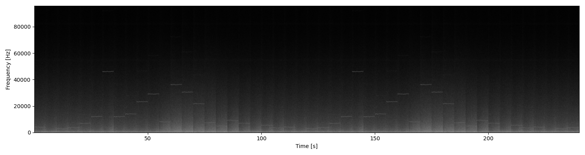

## Quality control
Now that you extracted metadata from the audios you are ready for assessing the quality of them.
 Many things can go wrong during a PAM  project: a recorder can run out off battery,  break after the installation for external factors, not be installed in the right way and many more. In this section you will learn how to use **pamflow**  to check  all deployed  sensors behaved as expected.

***Table of Contents***: 
1. [Sensor performance](#sensor-performance)
2. [Sensor location](#sensor-location)
3. [Timelapses](#timelapses)

### Sensor performance
Recall that the {{number_of_sensors}} installed sensors where  programmed for recording one minute every 30 minutes for {{number_of_days}} days. We would expect then that every sensor recorded 48 one-minute files per day. You can easilly and visually check this using **pamflow** by typing 

```bash
kedro run --nodes plot_sensor_performance
```

in the command line. 

As soon as the process is over the output is stored in the path `data\output\quality_control\sensor_performance.png`

 
Each dot in the plot shows the total minutes recorded by one sensor on one day, across the {{number_of_days}} days of monitoring. The dot’s size reflects the amount of recordings: ideally, all dots should be the same size, each representing 48 minutes. Larger values may come from accidental activation before installation or incorrect programming, while smaller values may indicate battery failure or sensor malfunction. In any case, unusual values require further examination.

 In this case, **pamflow** helped us identify that sensor {{broken_sensor_1}} failed on one day. In further steps we might want to discard the information of this sensor on this day (or even all the recordings by this sensor) to guarentee unifromity among the compared sensors. 
### Sensor location

In order to check the coordinates for each sensor  **pamflow** creates a map of the deployment.  To obtain it run 
```bash
kedro run --nodes plot_sensor_location
```
and check for the output in `data\output\quality_control\sensor_location.png`

 
### Timelapses

Even if all sensors recorded the correct number of files, their quality may still fall below the desired standard—for example, if something blocks the sound or the microphone is damaged. To check this without listening to every file, you can use pamflow to create a timelapse. A timelapse  is a summary of one day of acoustic activity by concatenating 5 seconds from each recording of that day (using a date with sufficient activity, chosen automatically). The result is an audio summary and corresponding spectrogram images for each sensor. To obtain this run 

```bash
kedro run --nodes get_timelapse_node
```

Both the resulting audio and spectrograms can be found  in `data\output\quality_control\timelapse`

``` 
data/
├── input/                        
└── output/                          
    ├── quality_control/          
    │   ├── timelapse/            # Timelapse outputs for quality control
    │       ├── MC-002_timelapse_2024-03-02.png  # Spectrogram for sensor MC-002
    │       ├── MC-002_timelapse_2024-03-02.WAV  # Timelapse audio for sensor MC-002
    │       ├── MC-007_timelapse_2024-03-02.png  # Spectrogram for sensor MC-009
    │       ├── MC-007_timelapse_2024-03-02.WAV  # Timelapse audio for sensor MC-009
    │       ├── MC-009_timelapse_2024-03-02.png  # Spectrogram for sensor MC-009
    │       ├── MC-009_timelapse_2024-03-02.WAV  # Timelapse audio for sensor MC-009
    │       ├── MC-013_timelapse_2024-03-02.png  # Spectrogram for sensor MC-013
    │       └── MC-013_timelapse_2024-03-02.WAV  # Timelapse audio for sensor MC-013
    └──               
```

Bellow, you will find two  examples for the resulting timelapse spectrograms
Spectrogram for sensor MC-002                |  Spectrogram for sensor {{broken_sensor_2}}
:-------------------------------------------:|:-------------------------:
 |  

In the first different signals are present in different frequencies and times. Meanwhile, the second one is not showing acoustic activity. This means that the recording quality of sensor {{broken_sensor_2}} is not as expected. You might want to discard these recordings in further steps for saving computational resources and keep the high quality of your data.

In the [next](./species_detection.md) section you will learn how to use **pamflow** for detecting target species in your audios.