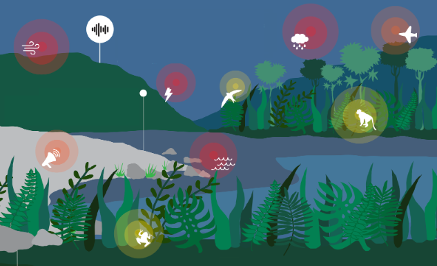

# **pamflow** Tutorial

Welcome to the **pamflow**'s tutorial! This guide will walk you through the steps to set up, run, and understand the outputs of this tool.

First let's  give some context to the data we will be working with and what kind of tasks are required uisng this data.

***Context***: 
*The National biodiversity institute in Colombia, the Humboldt Institute, collaborated with communities at Guaviare, Colombia to perform a communitary project on the local bird fauna. You are part of the project and your task is to process the passively collected acoustic data, extract insights and produce relevant metrics and graphics for a report on the project. You will use **pamflow** to help you.*

***Yor tasks***: 
1. Get familiar with the collected data.
2. Extract metadata from each audio file and each passive acoustic sensor.
3. Check that all sensors behaved as expected.
4. Report for presence of target species in the audios.
5. Select and store audio segments with target species' vocalizations.

On each of the followig sections you will find relevant information on how to use **pamflow** to complete all of your tasks. We are assuming you already installed and set up **pamflow** in your computer as explained  [here](../contributing_guidelines.md#getting-started).

## Table of Contents
1. [Input data](./input_data.md)
2. [Data Preparation](./data_preparation.md)
3. [Quality control](./quality_control.md)
4. [Species Detection, Segments and Data Annotation](./species_detection.md)

